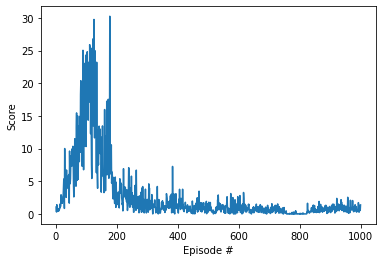

## What are we to do

Make the robotic arm stay in the goal position for 100 episodes and acheive a score of 30 at least.

|Parameter|Value|
|-|-|
|State Space|33|
|Action Space|4 continous values between -1 and 1, for 2 joints, each takes a tuple|
|# of agents|1|

## Contious action space

In a DQN it was easy to choose a discrete action. We had as many outputs coming in from the neural network as were the choices. In a continous
action space we cannot do that. So the output is basically between -1 and 1 and indicates the continous value. 

In this particular problem there are two joints and requires us to tell torques for both, which is a tuple. So overall four values are required 
for each action and the value is continous between the range -1. and 1.

## Environments

Two environments have been provided, one that has only one robotic arm and one agent in the environment and the other that has 20 robotic
arms and 20 different agents. The latter one provides an oppotunity to train faster by simultaneously evaluating and training agents.

In this solution, the **single agent environment** was used.


## DDPG

Deep Deterministic Policy Gradient (DDPG) has been used to solve this problem. [Original Paper](https://arxiv.org/abs/1509.02971)

DDPG, is an off-policy, actor-critic based learning algorithm, that uses DQN (Deep Q Network) to approximate the action and the value functions. The **actor** deterministically maps states to a specific action and
the **critic** provides a single output to tell how good (value) the next state, action combination would be. Target networks for actor and critic are kept separate and are updated
during learning.

|Network|Input|Output|Description|
|-|-|-|-|
|Actor Network|33|4|Actions that are to be taken in the given state|
|Critic Network|33 + 4 (state + action taken)|1|Value of the (given state, action) tuple|

The final scores achieved:


### Actor Network

The state that the environment is in is passed to the actor network, which outputs an action that is to be taken. In this enviornment, the output is a 4 value tuple that needs to be passed
to the environment.

|Layer|Input|Non Linear Function|Output|Weight Initialization|
|-|-|-|-|-|
|Input Layer|33|Relu|400|Orthognal Initialization (nn.init.orthogonal_)|
|Hidden Layer|400|Relu|300|Orthognal Initialization (nn.init.orthogonal_)|
|Ouptut|300|Relu|4|Uniform initialization (0.0003)|


### Critic Network

The critic takes the state' + action' that will be taken in the next state to find out the expected return from that point onwards.

The first layer of the critic neural network has the state values as input and the actions are fed
into the second layer.

|Layer|Input|Non Linear Function|Output|Weight Initialization|
|-|-|-|-|-|
|Input Layer|33|Relu|400|Orthognal Initialization (nn.init.orthogonal_)|
|Hidden Layer|400 + 4 (actions)|Relu|300|Orthognal Initialization (nn.init.orthogonal_)|
|Ouptut|300|Relu|1|Uniform initialization (0.0003)|


### Exploration

To ensure that the agent explores (and not only exploits) during training, a small noise is added to the action generated by the actor network. [Ornstein–Uhlenbeck process](https://en.wikipedia.org/wiki/Ornstein–Uhlenbeck_process) is used for generating the noise output.

*Note: the code for noise generation has been adopted from udacity provided code*
### Replay Buffer

A non-prioritized replay buffer is used for off-policy learning. Learning does not begin until the replay buffer is full and at each learning iteration a batch from the replay buffer is taken and trained upon. As new actions are taken in the environment, older (state, action, dones) pair are replaced with the new ones.

The replay buffer helps in reducing over fitting by decorrelating the trainging samples in each batch.

### Soft Update

Training is carried out on the actor / critic networks and after each training step the target network weights are adjusted using a percentage of the value of the local networks.

Exisitng weights * (1 - tau) + New weights * (tau)

## DDPG Algorithm

The overall DDPG algorithm:

Reference: [Original Paper](https://arxiv.org/pdf/1509.02971.pdf)


### Algorithm Implementation Details

The complete algorithm has been written in **class DDPGAgent**.

#### Step 1: **Initialize Training**

1. Local actor / critic networks are created and weights are initialized
2. Target actor / critic network are created
2. Weights from the local networks are copied over to the target network
3. Optimizers are created
4. Replay buffer is cleared

#### Step 2: **Gather Initial Samples**

Each iteration, `step()` is called that checks if Replay Buffer is not full, keeps adding the new (state, action, dones) to the buffer.

#### Step 3: **Learn Every N Steps**

1. Every 10th step `_learn()` is called
2. A batch of 128 samples is taken from the replay buffer
3. **Find next action** to be taken in next state by passing `next_state` to `actor_target` network

```
        u_prime = lambda next_states: self.actor_target(next_states).detach()

        q_next_action = u_prime(next_states)
```
4. **Find value of next_state** by passing `next_state, next_action` to `critic_target` network

```
        q_prime = lambda next_states, next_actions: self.critic_target(next_states, next_actions)

        q_next_value = q_prime(next_states, q_next_action)
```

5. Use bellman equation to **find Expected Reward** of taking `action` in `state` by adding the immediate reward with the next state value.

```
        y = rewards + self.gamma * q_next_value * (1 - dones)
```

6. Compute **Critic Loss**:

*Current Value*: The local critic network gives an estimate of how good (it thinks) is action `a` in state `s`. 

*Future Value*: The target cirtic network gives an estimate of how good the next state would be. The *target actor tells us the action* it will take in next state and the target critic network
tell us how good that action would be in the next_state. 

*Future reward*: `y` is computed based on the future value + immediate reward.

*Critic loss*: the difference between the future reward calculated and the current value.

a. Pass `current state` and `action` to **local critic network** and find the value of (current state, action)

```
        q = lambda states, actions: self.critic(states, actions)
        q_state_action = q(states, actions)
```

b. Compute **Mean Squared Error** between the expected reward (immediate reward + next state value) and the q value returned by critic network for `(current_state, action)`

c. Back propogate and optimize the local critic network weights using Adam Optimizer

7. Compute **Actor Loss**:

1. Find the action `a_pred` that the local actor would take in state `s`.

2. Pass the `a_pred` to the local_critic network for state `s`

3. Gradient of the mean of the critic network is to be used as the loss function to compute gradient of the actor network. This is easily achieved in PyTorch  by:

a. Pass actor parameters to Actor optimizer    
b. Compute loss on critic network output      
c. Tell actor optimizer to back propogate. Since it only has the actor parameters, it will use the critic gradient calculated till the output of actor for back propogation.     


## Hyperparameters

|Paremeter|Description|Value|
|-|-|-|
|Soft Update Rate (tau)|How much of the critic / actor network is to be copied over to the target|0.001|
|Replay buffer batch size|# of samples in the batch for Stochasitc Gradient Descent (SGD) algorithm|128
|Replay buffer size|The maximum # of samples that are kept in the buffer|10000|
|Learning Rate|How often should the agent invoke _learn (to learn)|10 steps|
|OU Noise|To ensure agent explores during training|mu=0., theta=0.15, sigma= 0.2|
|Critic optimizer|Back propogation optimizing algorithm|Adam|
|Critic learning rate|How much of the gradient is to be applied to update weights|0.001|
|Actor optimizer|Back propogation optimizing algorithm|Adam|
|Actor learning rate|How much of the gradient is to be applied to update weights|0.0001|
|Gamma|Future reward discount rate|0.99|

## Issues Faced

If training is done on each step the algorithm fails to achieve the result. 



## Shortcomings and Future Work

1. GAE has not been used   
2. Batch Normalization (although code has been written by mean and std. deviation have not been calcualted to normalize batch)
3. D4PG to be used to take advantage of multiple agents in the environment